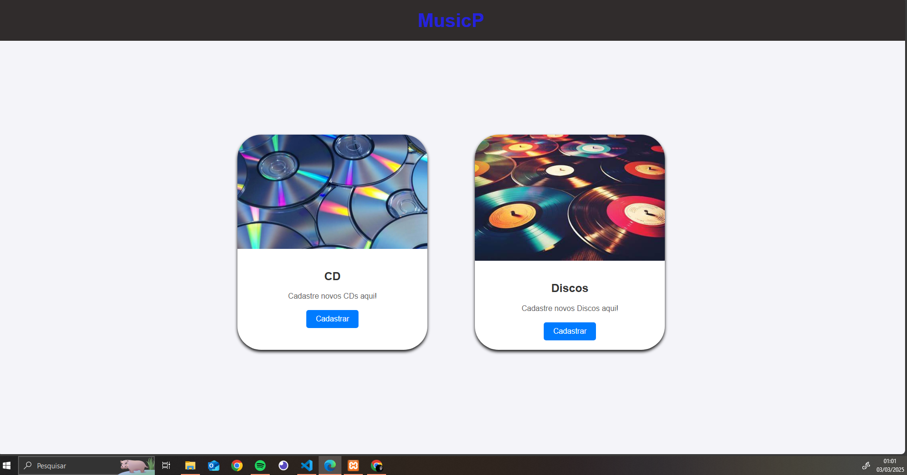
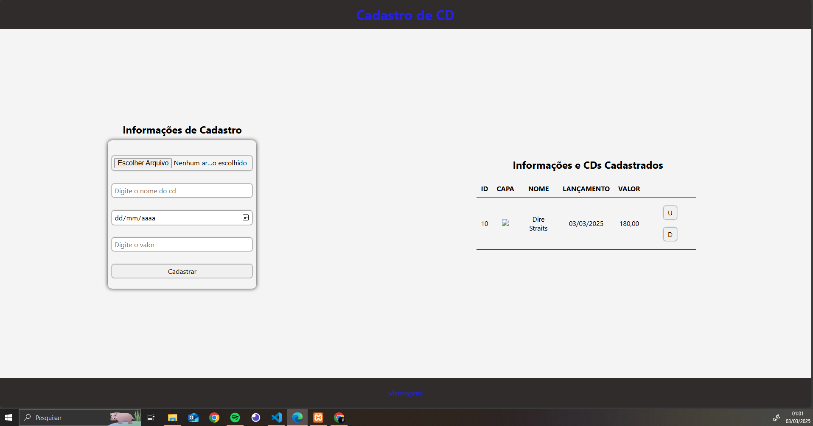
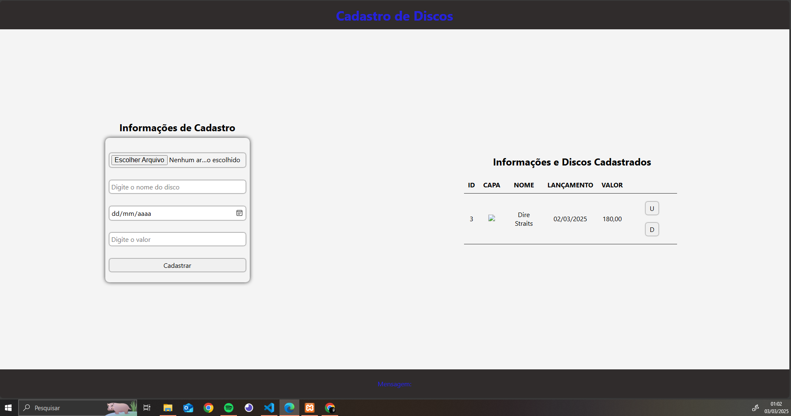

# Documentação, Tecnologias e Testes

## Tecnologias Utilizadas

- VsCode, 
- Node.js, 
- Insomnia, 
- Xampp, 
- MySQL

## Documentação do Projeto

- 1. Uma loja de artigos musicais (discos e cds) precisa de um site de cadastro de produtos conectada com um banco de dados;
- 2. Uma pagina principal com duas guias, uma para cadastro de cds e outra para cadastro de discos;
- 3. A guia Cadastro de CDs conta com uma pequeno formulario onde o usuario ira colocar informações do cd (capa, nome, lançamento e valor);
- 4. Na guia Cadastro de Discos a mesma ocorre que ocorreu anteriormente dito no Cadastro de CDs;
- 5. Apos o cadastro de ambos, tanto discos quanto cds, todas as informações iram para o banco de dados conectados com o front-end e back-end.

## Imagens do Projeto

## Testes

Foram feitos testes praticos com o projeto e teste usando o programa Insomnia. Testamos as portas, e todos os atributos (GET, POST, DELETE e UPDATE)

## Creditos 

Pedro Duarte Naddeu Russo
